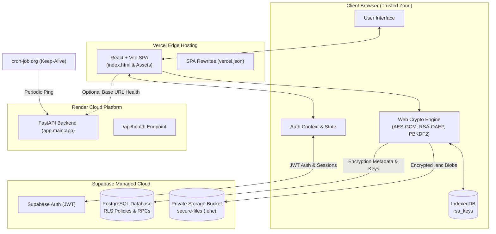
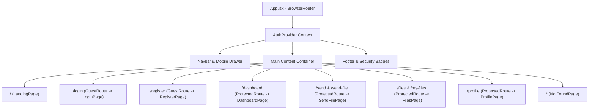
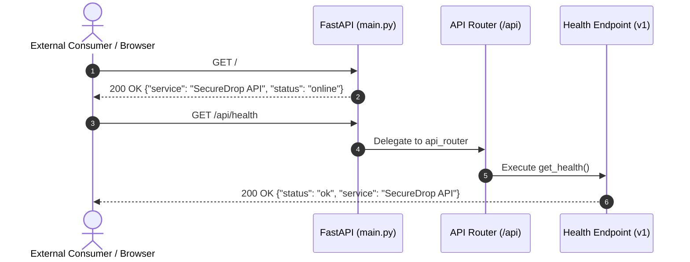
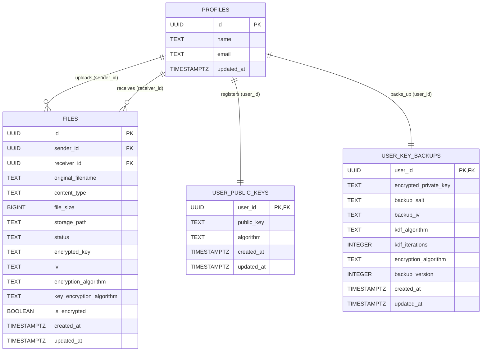
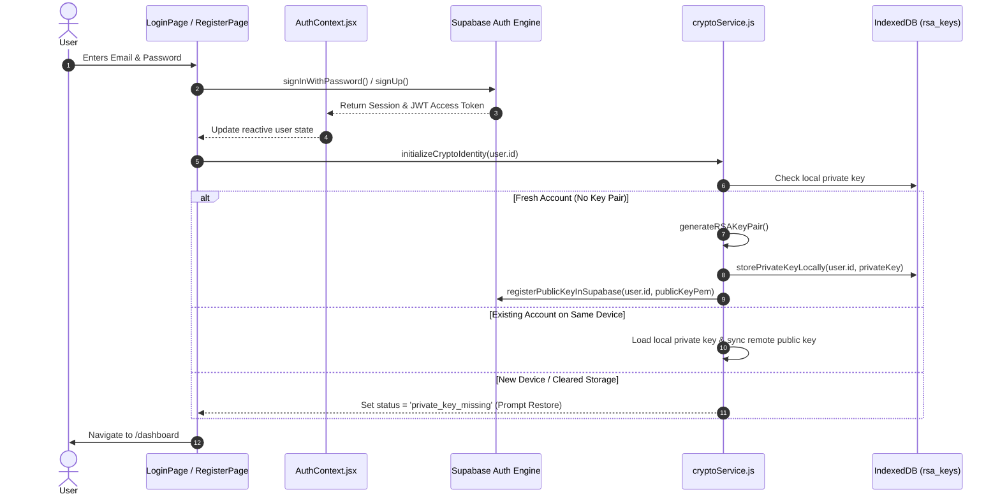
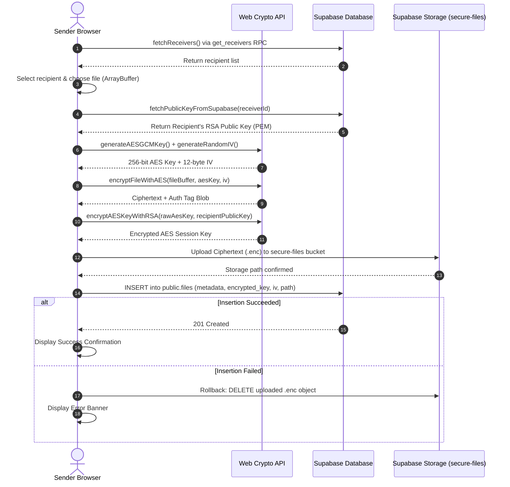
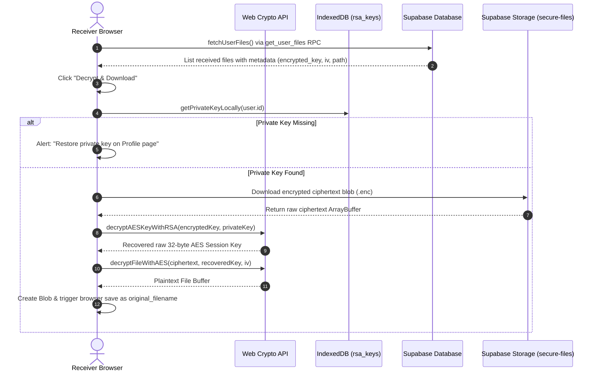
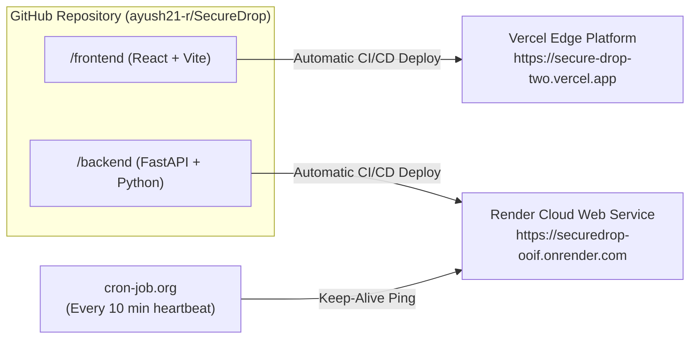

<div align="center">

# 🛡️ SecureDrop

**Zero-Knowledge Hybrid Cryptography File-Sharing Platform**

[](https://secure-drop-two.vercel.app/)
[](https://securedrop-ooif.onrender.com)
[](https://github.com/ayush21-r/SecureDrop)
[](#-cryptography-architecture)

<p align="center">
  <b>SecureDrop</b> is a production-grade, end-to-end encrypted web application engineered for zero-knowledge document transfer. Files are symmetrically encrypted in-memory with unique <b>AES-GCM-256</b> session keys, encapsulated with the recipient's <b>RSA-OAEP-2048</b> public key, and transmitted exclusively as authenticated ciphertext. Private RSA keys are generated client-side and isolated within browser <b>IndexedDB</b>—neither plaintext file contents, session keys, nor private identity keys ever touch the server.
</p>

[Explore Live Demo](https://secure-drop-two.vercel.app/) • [API Documentation](https://securedrop-ooif.onrender.com/docs) • [Architecture Overview](#-system-architecture) • [Local Setup](#-installation--local-development)

---

</div>

## 📑 Table of Contents

1. [Project Overview](#-project-overview)
2. [Key Features](#-key-features)
3. [Technology Stack](#-technology-stack)
4. [System Architecture](#-system-architecture)
5. [Frontend Architecture](#-frontend-architecture)
6. [Backend Architecture](#-backend-architecture)
7. [Database & Supabase Architecture](#-database--supabase-architecture)
8. [Authentication Flow](#-authentication-flow)
9. [Cryptography Deep Dive](#-cryptography-deep-dive)
   - [AES-GCM-256 (Payload Encryption)](#1-aes-gcm-256-payload-cipher)
   - [RSA-OAEP-2048 (Key Encapsulation)](#2-rsa-oaep-2048-asymmetric-key-protection)
   - [Why Hybrid Cryptography?](#3-why-hybrid-cryptography-comparison)
   - [SHA-256 (Integrity & Derivation)](#4-sha-256-hashing--fingerprinting)
10. [End-to-End File Transfer Flows](#-end-to-end-file-transfer-flows)
    - [File Encryption & Transmission Pipeline](#1-complete-file-sending-flow)
    - [File Retrieval & Decryption Pipeline](#2-complete-file-receiving--decryption-flow)
11. [Cryptographic Key Lifecycle & Multi-Device Recovery](#-cryptographic-key-lifecycle--multi-device-recovery)
12. [Security Model & Trust Boundaries](#-security-model--trust-boundaries)
13. [API Architecture](#-api-architecture)
14. [Deployment Infrastructure](#-deployment-infrastructure)
15. [Environment Variables](#-environment-variables)
16. [Installation & Local Development](#-installation--local-development)
17. [Production Deployment Guide](#-production-deployment-guide)
18. [Project Directory Tree](#-project-directory-tree)
19. [UI & User Experience](#-ui--user-experience)
20. [Error Handling & Edge Cases](#-error-handling--edge-cases)
21. [Testing & Verification](#-testing--verification)
22. [Security Considerations & Limitations](#-security-considerations--limitations)
23. [Future Roadmap](#-future-roadmap)
24. [License](#-license)

---

## 📖 Project Overview

### The Vulnerability of Conventional File Sharing
Traditional cloud storage and file-transfer systems operate on a **server-trust model**: files are transmitted over HTTPS to a central server that decrypts TLS traffic, inspects or processes the data, and stores it in cloud buckets using server-managed encryption keys. Under this architecture:
- Cloud operators, database administrators, and hosting providers hold full access to user documents.
- Server-side compromises, misconfigured storage buckets, or unauthorized insider access directly expose sensitive plaintext records.
- "Encryption at rest" managed by cloud providers fails to protect against subpoena, server-side credential exfiltration, or infrastructure takeover.

### The SecureDrop Paradigm
SecureDrop fundamentally reverses this model through **Zero-Knowledge Client-Side Cryptography**:
- **Pure Client Execution:** Encryption and decryption occur strictly inside the user's browser using the native **Web Crypto API** (`window.crypto.subtle`).
- **No Plaintext In Transit or Rest:** Files are encrypted into authenticated ciphertext *before* leaving browser memory.
- **Isolated Key Management:** Private RSA keys are generated client-side and saved into browser **IndexedDB**, never exposed over the network.
- **Asymmetric Peer-to-Peer Encapsulation:** Senders wrap unique per-file AES keys with the specific recipient's RSA public key, ensuring only the intended recipient's device can ever decrypt the data.

---

## ⚡ Key Features

| Category | Feature | Verification & Implementation Detail |
| :--- | :--- | :--- |
| **Authentication** | Supabase Auth (JWT) | Email & password registration with Argon2/bcrypt password hashing and persistent JWT sessions. |
| **Route Protection** | Protected & Guest Routes | Client-side React Router route guards redirecting unauthenticated traffic to `/login` and authenticated sessions to `/dashboard`. |
| **Payload Cipher** | AES-GCM-256 | High-speed authenticated encryption utilizing 256-bit keys, unique 96-bit IVs, and 128-bit integrity tags. |
| **Key Exchange** | RSA-OAEP-2048 | Asymmetric public key encapsulation with SHA-256 digest and 65537 public exponent. |
| **Identity Management** | Browser Key Isolation | Private RSA keys stored in client `IndexedDB` (`SecureDropKeyStore`), never transmitted to servers. |
| **Public Directory** | Remote Public Key Sync | Public keys stored in Supabase `public.user_public_keys` with SHA-256 fingerprint generation. |
| **Multi-Device Recovery** | Zero-Knowledge Key Backup | Client-side private key export to JWK wrapped with PBKDF2 (250,000 rounds) + AES-GCM-256 stored in `user_key_backups`. |
| **Storage Security** | Supabase Private Bucket | Ciphertext `.enc` objects stored in private `secure-files` bucket governed by storage RLS. |
| **Data Access** | Row-Level Security (RLS) | PostgreSQL RLS policies ensuring users can only read files they uploaded or were designated to receive. |
| **Live Diagnostics** | Web Crypto Self-Tests | In-browser cryptographic self-tests for RSA-OAEP key loop and AES-GCM hybrid transmission directly on Profile and Send pages. |
| **Production UI** | Real Metric Dashboard | Live calculation of sent files, received files, active RSA key parameters, and vault storage volume with zero dummy data. |
| **SPA Reliability** | Vercel SPA Routing | `vercel.json` rewrites and custom `NotFoundPage` handling deep routes without 404 drops. |

---

## 🛠️ Technology Stack

```
                               ┌────────────────────────┐
                               │   React 18 + Vite 6    │
                               │   Tailwind CSS v3.4    │
                               │     Web Crypto API     │
                               └───────────┬────────────┘
                                           │ HTTPS / TLS
                    ┌──────────────────────┴──────────────────────┐
                    ▼                                             ▼
       ┌────────────────────────┐                    ┌────────────────────────┐
       │     FastAPI 0.115      │                    │   Supabase Platform    │
       │    Python 3.10+ ASGI   │                    │   PostgreSQL 15 + RLS  │
       │   Pydantic Settings    │                    │   Auth & Storage Blob  │
       └────────────────────────┘                    └────────────────────────┘
```

### Verified Dependencies & Roles

| Category | Component / Library | Purpose in SecureDrop |
| :--- | :--- | :--- |
| **Frontend Framework** | `react` (v18.3.1) & `react-dom` | Component-driven user interface and reactive state management. |
| **Build & Tooling** | `vite` (v6.1.0) & `@vitejs/plugin-react` | Ultra-fast ES-module bundler with production asset minification. |
| **Styling & Icons** | `tailwindcss` (v3.4.17) & `lucide-react` | Accessible responsive design system and cybersecurity iconography. |
| **Routing** | `react-router-dom` (v7.18.2) | Client-side SPA navigation, route guards (`ProtectedRoute`, `GuestRoute`), and aliases. |
| **Cryptography** | `Web Crypto API` (`SubtleCrypto`) | Hardware-accelerated client-side key generation, AES-GCM, RSA-OAEP, PBKDF2, and SHA-256. |
| **Client Storage** | `IndexedDB API` | Non-volatile, browser-isolated private RSA key persistence (`SecureDropKeyStore`). |
| **Backend Framework** | `fastapi` (v0.115.0+) | High-performance Python ASGI backend for health checks and API routing. |
| **ASGI Server** | `uvicorn[standard]` (v0.32.0+) | Production-ready HTTP/1.1 and WebSocket server implementation for FastAPI. |
| **Data Validation** | `pydantic-settings` (v2.6.0+) | Strictly-typed environment variable schema validation. |
| **Database & Auth** | `@supabase/supabase-js` (v2.112.4) | Managed PostgreSQL connection, JWT authentication, and Storage API client. |
| **Frontend Host** | `Vercel` | Edge global CDN hosting with SPA rewrite rules. |
| **Backend Host** | `Render` | Managed cloud container environment running FastAPI. |
| **Availability Monitor**| `cron-job.org` | Automated external heartbeat keeping the Render backend warm. |

---

## 🏛️ System Architecture



---

## 💻 Frontend Architecture

The frontend is structured into modular layers adhering to separation of concerns:

```
frontend/src/
├── components/          # Reusable UI primitives (Button, Card, Input, EmptyState, Badges)
├── context/             # React Context providers (AuthContext for JWT session lifecycle)
├── lib/                 # External service clients (supabase.js client initialization)
├── pages/               # Top-level view controllers & route endpoints
├── services/            # Cryptographic, File Transfer, and Backend API logic
├── App.jsx              # Central router configuration with Protected and Guest route wrappers
├── index.css            # Tailwind directives, theme variables, and custom scrollbars
└── main.jsx             # React DOM root mounting entry point
```

### Component & Routing Hierarchy



---

## ⚙️ Backend Architecture

The backend is built with **FastAPI** to provide a production-ready API foundation:

```
backend/app/
├── api/
│   ├── router.py               # Aggregates API routers under /api
│   └── v1/
│       └── endpoints/
│           └── health.py       # GET /api/health endpoint returning HealthResponse
├── core/
│   └── config.py               # Pydantic BaseSettings for environment variables
├── schemas/
│   └── health.py               # Pydantic models for API response validation
└── main.py                     # FastAPI application factory, CORS setup, and root routes
```



---

## 🗄️ Database & Supabase Architecture

SecureDrop utilizes Supabase PostgreSQL with strict **Row-Level Security (RLS)** and **Security Definer RPCs** to isolate tenant data.



### SQL Migrations Reference

| Migration Script | Table / Function | Purpose & RLS Enforced |
| :--- | :--- | :--- |
| **[user_public_keys.sql](backend/sql/user_public_keys.sql)** | `public.user_public_keys` | Stores RSA-OAEP public key PEMs. RLS: `SELECT` allowed for all authenticated users; `INSERT`/`UPDATE` restricted to `auth.uid() = user_id`. |
| **[user_key_backups.sql](backend/sql/user_key_backups.sql)** | `public.user_key_backups` | Stores zero-knowledge PBKDF2-encrypted private key backups. Owner-only RLS: `SELECT`, `INSERT`, `UPDATE`, `DELETE` restricted strictly to `auth.uid() = user_id`. |
| **[phase_3_2_encryption.sql](backend/sql/phase_3_2_encryption.sql)** | `public.files` & `get_user_files()` | Adds `encrypted_key`, `iv`, `encryption_algorithm`, `key_encryption_algorithm`, and `is_encrypted` columns to `public.files`. Updates `get_user_files()` RPC to return join of sender/receiver metadata. |
| **[get_receivers.sql](backend/sql/get_receivers.sql)** | `get_receivers()` RPC | Returns registered profiles (excluding current user) without exposing global `profiles` table to unrestricted reads. |
| **[get_user_files.sql](backend/sql/get_user_files.sql)** | `get_user_files()` RPC | Securely returns files where `sender_id = auth.uid() OR receiver_id = auth.uid()`. |

---

## 🔐 Authentication Flow

SecureDrop uses Supabase Auth with JWT access tokens stored in browser local storage and synchronized via React Context.



---

## 🔒 Cryptography Deep Dive

SecureDrop implements a **hybrid cryptosystem** combining the speed of symmetric stream ciphers with the secure key-exchange properties of asymmetric cryptography.

```
                                 HYBRID ENCRYPTION
                 ┌───────────────────────┴───────────────────────┐
                 ▼                                               ▼
         Symmetric Layer                                 Asymmetric Layer
          [AES-GCM-256]                                  [RSA-OAEP-2048]
    Fast payload encryption                        Secure session key exchange
Unique key per file + 96-bit IV                 Encapsulates 256-bit AES key with
Authenticates ciphertext integrity               recipient's verified public key
```

---

### 1. AES-GCM-256 (Payload Cipher)

- **Beginner Explanation:** AES is like a high-speed digital vault that locks up the entire contents of your file using a unique secret key.
- **Technical Explanation:** Advanced Encryption Standard in Galois/Counter Mode (AES-GCM) is an **Authenticated Encryption with Associated Data (AEAD)** algorithm. It provides both confidentiality (protecting contents from eavesdroppers) and cryptographic integrity (detecting any unauthorized bit modification or tampering) using an authentication tag.

```
Plaintext File Buffer (ArrayBuffer)
         │
         ├───► Random 256-bit AES Key (window.crypto.subtle.generateKey)
         ├───► Unique 96-bit IV (window.crypto.getRandomValues)
         ▼
 ┌───────────────┐
 │  AES-256-GCM  │ ──► Native Web Crypto SubtleCrypto.encrypt()
 └───────┬───────┘
         ▼
 Ciphertext Payload + 128-bit Authentication Tag (appended)
```

- **Key Length:** 256 bits (32 bytes), providing $2^{256}$ potential key combinations.
- **Initialization Vector (IV):** 96 bits (12 bytes) cryptographically generated per transfer. Never reused with the same key.
- **Authentication Tag:** 128 bits verifying ciphertext authenticity upon decryption.

---

### 2. RSA-OAEP-2048 (Asymmetric Key Protection)

- **Beginner Explanation:** RSA acts as a secure digital mailbox. Anyone can use the recipient's public key to lock an envelope containing the AES key, but only the recipient possesses the private key needed to open it.
- **Technical Explanation:** RSA-OAEP (Optimal Asymmetric Encryption Padding) is an asymmetric encryption scheme. RSA is computationally too expensive to encrypt multi-megabyte files directly, so SecureDrop uses RSA exclusively to **encapsulate (wrap)** the raw 32-byte AES session key.

```
Raw 32-byte AES Key Buffer
         │
         ├───► Recipient's RSA Public Key (2048-bit, e=65537, SHA-256)
         ▼
 ┌───────────────┐
 │  RSA-OAEP     │ ──► Native Web Crypto SubtleCrypto.encrypt()
 └───────┬───────┘
         ▼
 Encrypted Session Key (256 bytes / Base64 encoded)
```

- **Modulus Length:** 2048 bits.
- **Public Exponent:** $65537$ (`0x010001`).
- **Padding & Hash:** OAEP with SHA-256 mask generation function.

---

### 3. Why Hybrid Cryptography? Comparison

| Property | Symmetric Only (AES) | Asymmetric Only (RSA) | Hybrid (SecureDrop: AES + RSA) |
| :--- | :--- | :--- | :--- |
| **Speed / Throughput** | Extremely fast (GB/s via hardware acceleration) | Very slow (computational math on large primes) | **High Speed** (file encrypted via AES-GCM) |
| **Maximum Data Size** | Virtually unlimited (gigabytes/terabytes) | Strictly limited ($\le 190$ bytes with RSA-2048 OAEP) | **Full File Support** (up to 50 MB standard limit) |
| **Key Distribution** | Requires pre-shared secret over secure channel | Public key distributed freely over untrusted network | **Public Key Distribution** (recipient's public key) |
| **Security Guarantees** | Confidentiality + AEAD Integrity | Public-key confidentiality | **Best of Both Worlds: Fast AEAD + Asymmetric Exchange** |

---

### 4. SHA-256 (Hashing & Fingerprinting)

- **Beginner Explanation:** A cryptographic hash is a one-way digital fingerprint. Even changing a single punctuation mark produces a completely different fingerprint.
- **Technical Explanation:** SecureHash Algorithm 256-bit (SHA-256) is a one-way cryptographic function producing a deterministic 32-byte (256-bit) digest. In SecureDrop:
  1. **Key Fingerprints:** Computes public key fingerprints displayed in the UI:
     $$\text{Fingerprint} = \text{SHA256}(\text{SPKI\_PEM}) \rightarrow \text{Hex String}$$
  2. **PBKDF2 HMAC:** Serves as the pseudo-random function inside PBKDF2 (250,000 rounds) for zero-knowledge key backups.

---

## 🚀 End-to-End File Transfer Flows

### 1. Complete File Sending Flow



---

### 2. Complete File Receiving / Decryption Flow



---

## 🔑 Cryptographic Key Lifecycle & Multi-Device Recovery

```
                             KEY LIFECYCLE
                                   │
              ┌────────────────────┴────────────────────┐
              ▼                                         ▼
      First-Time Sign-Up                        Multi-Device Login
   generateRSAKeyPair()                 User logs in on new device / browser
              │                                         │
     ┌────────┴────────┐                                ▼
     ▼                 ▼                       Private key missing in IDB
Private Key        Public Key                           │
 (IndexedDB)    (user_public_keys)                      ▼
                                            Enter Recovery Passphrase
                                                        │
                                                        ▼
                                           PBKDF2-SHA256 (250k iterations)
                                                        │
                                                        ▼
                                             Decrypt Private Key JWK
                                                        │
                                                        ▼
                                          Verify Public Key Match with DB
                                                        │
                                                        ▼
                                           Save to local IndexedDB (Active)
```

### Zero-Knowledge Key Backup Protocol

1. **Passphrase Derivation:** When a user sets a recovery passphrase on the Profile page, the browser runs **PBKDF2-HMAC-SHA256** with **250,000 iterations** and a fresh 16-byte cryptographic salt to derive a 256-bit AES wrapping key.
2. **JWK Serialization & Wrapping:** The private key is exported to JSON Web Key (JWK) format and encrypted in-memory using **AES-GCM-256** with a random 12-byte IV.
3. **Owner-Isolated Storage:** The resulting ciphertext, salt, and IV are stored in `public.user_key_backups`.
4. **Key Match Verification:** Upon restoration on a second device, the private key is decrypted, its corresponding public key is reconstructed, and its exported SPKI PEM is compared against `public.user_public_keys`. Only if the cryptographic identity matches perfectly is it written into `SecureDropKeyStore`.

---

## 🛡️ Security Model & Trust Boundaries

### Data Access & Visibility Matrix

| Asset | Sender Browser | Recipient Browser | FastAPI (Render) | Supabase DB / Storage | Network / ISP |
| :--- | :---: | :---: | :---: | :---: | :---: |
| **Plaintext File Contents** | ✅ Full Access | ✅ Full Access | ❌ Never Visible | ❌ Never Visible | ❌ Encrypted (TLS) |
| **AES-256 Session Key** | ✅ In-Memory | ✅ In-Memory | ❌ Never Visible | ❌ Never Visible | ❌ Encrypted (TLS) |
| **Private RSA Key** | ❌ None | ✅ In-Memory / IDB | ❌ Never Visible | ❌ Never Visible | ❌ Never Visible |
| **Recovery Passphrase** | ❌ None | ✅ In-Memory (User Input)| ❌ Never Visible | ❌ Never Visible | ❌ Never Visible |
| **Ciphertext Payload (.enc)**| ✅ Transient | ✅ Transient | ❌ No Storage Role | ✅ Stored in Bucket | ❌ Encrypted (TLS) |
| **File Metadata (Name, Size)**| ✅ Visible | ✅ Visible | ❌ Not Queried | ✅ Stored in Table | ❌ Encrypted (TLS) |
| **Registered Public Keys** | ✅ Visible | ✅ Visible | ❌ Not Queried | ✅ Stored in Table | ❌ Encrypted (TLS) |

### Security Guarantees & Assumptions
- **Storage Compromise Resistance:** If the Supabase database or storage bucket is breached, attackers obtain only `.enc` ciphertext and RSA-wrapped keys. Decryption is computationally infeasible without the recipient's private key.
- **Authenticated Integrity:** Modifying a single byte of ciphertext causes AES-GCM to reject decryption, preventing ciphertext manipulation attacks.
- **Client Boundary Assumption:** The client operating system and browser runtime are assumed uncompromised (free of malicious keyloggers or malicious extensions with full DOM/memory read permissions).

---

## 🔌 API Architecture

The FastAPI backend exposes standard OpenAPI/ReDoc documentation endpoints:

| Method | Route | Description | Auth Required |
| :--- | :--- | :--- | :---: |
| `GET` | `/` | Root service metadata and uptime status | No |
| `GET` | `/api/health` | Service health status check (`HealthResponse`) | No |
| `GET` | `/docs` | Interactive Swagger UI API documentation | No |
| `GET` | `/redoc` | ReDoc API specification documentation | No |

*Note: Frontend data operations (authentication, metadata querying, and ciphertext storage) connect directly to Supabase via `@supabase/supabase-js` using Row-Level Security.*

---

## 🌐 Deployment Infrastructure



### Render Keep-Alive Configuration
Render free-tier web services enter a sleep state after 15 minutes of inactivity. SecureDrop uses **cron-job.org** to send an automated HTTP GET request to `https://securedrop-ooif.onrender.com/` on a 10-minute interval, preventing cold starts while avoiding unnecessary client-side polling.

---

## 🔑 Environment Variables

### Frontend (`frontend/.env`)
| Variable | Description | Required | Example Format |
| :--- | :--- | :---: | :--- |
| `VITE_API_BASE_URL` | Base URL of the FastAPI backend service | Yes | `https://securedrop-ooif.onrender.com` |
| `VITE_SUPABASE_URL` | Supabase Project URL | Yes | `https://xyzproject.supabase.co` |
| `VITE_SUPABASE_ANON_KEY`| Supabase Public Anonymous API Key | Yes | `eyJhbGciOiJIUzI1NiIsIn...` |

### Backend (`backend/.env`)
| Variable | Description | Required | Default / Example |
| :--- | :--- | :---: | :--- |
| `PROJECT_NAME` | Name of the backend application | No | `"SecureDrop API"` |
| `ENVIRONMENT` | Runtime mode (`development` or `production`) | No | `"production"` |
| `DEBUG` | FastAPI reload and debug flag | No | `False` |
| `HOST` | Bind interface host | No | `"0.0.0.0"` |
| `PORT` | Bind server port (auto-set by Render) | No | `8000` |
| `ALLOWED_ORIGINS` | Comma-separated list of CORS allowed origins | Yes | `https://secure-drop-two.vercel.app,http://localhost:5173` |

---

## 💻 Installation & Local Development

### Prerequisites
- **Node.js** (v18.0.0 or later) & **npm**
- **Python** (v3.10 or later) & **pip**
- **Git**
- A free **Supabase** account with a configured project

---

### 1. Windows One-Click Start
If running on Windows, double-click the included batch launcher:
```cmd
start.bat
```
This script validates Python/Node installations, installs missing dependencies, launches both services, and opens the browser.

---

### 2. Manual Frontend Setup
```bash
# Clone the repository
git clone https://github.com/ayush21-r/SecureDrop.git
cd SecureDrop/frontend

# Install Node dependencies
npm install

# Configure environment secrets
cp .env.example .env
# Edit .env with your Supabase URL & Anon Key

# Start development server
npm run dev
```
Frontend development server: `http://localhost:5173`

---

### 3. Manual Backend Setup
```bash
# Navigate to backend
cd ../backend

# Create and activate virtual environment
python -m venv .venv

# Windows (PowerShell)
.\.venv\Scripts\Activate.ps1
# Linux / macOS
source .venv/bin/activate

# Install Python packages
pip install -r requirements.txt

# Configure environment secrets
cp .env.example .env

# Run FastAPI with live reload
uvicorn app.main:app --reload --host 127.0.0.1 --port 8000
```
Backend API server: `http://127.0.0.1:8000` • Swagger Docs: `http://127.0.0.1:8000/docs`

---

### 4. Database Setup
Run the SQL migration scripts in your **Supabase SQL Editor** in the following sequence:
1. `backend/sql/user_public_keys.sql`
2. `backend/sql/user_key_backups.sql`
3. `backend/sql/phase_3_2_encryption.sql`
4. `backend/sql/get_receivers.sql`
5. `backend/sql/get_user_files.sql`

---

## 🚀 Production Deployment Guide

### Vercel (Frontend)
1. Import repository on [Vercel](https://vercel.com).
2. Set **Root Directory** to `frontend`.
3. Select **Vite** framework preset (Build: `npm run build`, Output: `dist`).
4. Add environment variables: `VITE_API_BASE_URL`, `VITE_SUPABASE_URL`, `VITE_SUPABASE_ANON_KEY`.
5. Deploy. `vercel.json` ensures full SPA routing support.

### Render (Backend)
1. Create a new **Web Service** on [Render](https://render.com) linked to your repo.
2. Set **Root Directory** to `backend`.
3. **Environment:** `Python 3`.
4. **Build Command:** `pip install -r requirements.txt`.
5. **Start Command:** `uvicorn app.main:app --host 0.0.0.0 --port $PORT`.
6. Add environment variables: `ALLOWED_ORIGINS` (your Vercel URL), `ENVIRONMENT=production`, `DEBUG=False`.

---

## 📁 Project Directory Tree

```
SecureDrop/
├── .gitignore
├── README.md                       # Comprehensive project documentation
├── start.bat                       # One-click Windows local development launcher
├── vercel.json                     # Root Vercel SPA routing fallback configuration
│
├── frontend/                       # React + Vite Single Page Application
│   ├── public/                     # Static media and brand assets
│   ├── src/
│   │   ├── components/             # Reusable UI components
│   │   │   ├── Button.jsx          # Accessible button with loading/variant states
│   │   │   ├── Card.jsx            # Themed container card with action slots
│   │   │   ├── EmptyState.jsx      # Empty list indicator with call-to-action
│   │   │   ├── Footer.jsx          # Global navigation footer with security info
│   │   │   ├── GuestRoute.jsx      # Route guard for unauthenticated users
│   │   │   ├── HealthBadge.jsx     # Production backend configuration indicator
│   │   │   ├── Input.jsx           # Form input with validation and icon slots
│   │   │   ├── LoadingScreen.jsx   # Full-page loading spinner for auth transitions
│   │   │   ├── Navbar.jsx          # Desktop header and mobile navigation drawer
│   │   │   ├── PageHeader.jsx      # Standardized header with badge & actions
│   │   │   ├── ProtectedRoute.jsx  # Route guard redirecting to /login
│   │   │   └── StatusBadge.jsx     # Visual state badge (ready, pending, error)
│   │   ├── context/
│   │   │   └── AuthContext.jsx     # Supabase JWT session provider and user state
│   │   ├── lib/
│   │   │   └── supabase.js         # Supabase client singleton initialization
│   │   ├── pages/                  # Application views
│   │   │   ├── DashboardPage.jsx   # Live file metrics & recent transfer activity
│   │   │   ├── FilesPage.jsx       # Received & Sent vaults with Decrypt & Download
│   │   │   ├── LandingPage.jsx     # Public landing page with security overview
│   │   │   ├── LoginPage.jsx       # User authentication with show/hide password
│   │   │   ├── NotFoundPage.jsx    # Themed 404 handler for unknown routes
│   │   │   ├── ProfilePage.jsx     # RSA public key, self-test & multi-device recovery
│   │   │   ├── RegisterPage.jsx    # Signup form with input validation
│   │   │   └── SendFilePage.jsx    # File upload & hybrid encryption pipeline
│   │   ├── services/               # Core business & crypto logic
│   │   │   ├── api.js              # Axios client configured for FastAPI backend
│   │   │   ├── cryptoService.js    # Web Crypto engine (AES, RSA, PBKDF2, IndexedDB)
│   │   │   └── fileService.js      # Hybrid transmission, download & rollback logic
│   │   ├── App.jsx                 # Central router with route aliases & guards
│   │   ├── index.css               # Tailwind directives and custom styling
│   │   └── main.jsx                # React DOM entry point
│   ├── index.html                  # HTML5 template entry point
│   ├── package.json                # Frontend package dependencies & scripts
│   ├── package-lock.json           # Locked frontend dependency tree
│   ├── postcss.config.js           # PostCSS configuration for Tailwind
│   ├── tailwind.config.js          # Tailwind CSS theme extensions
│   ├── vercel.json                 # Frontend-specific SPA rewrite configuration
│   ├── vite.config.js              # Vite bundler & development server configuration
│   ├── .env.example                # Template for frontend environment secrets
│   └── .env                        # Local frontend environment secrets (gitignored)
│
└── backend/                        # FastAPI Python Backend
    ├── app/
    │   ├── api/                    # API route definitions
    │   │   ├── router.py           # Aggregated API router
    │   │   └── v1/
    │   │       └── endpoints/
    │   │           └── health.py   # GET /api/health endpoint
    │   ├── core/
    │   │   └── config.py           # Pydantic Settings environment configuration
    │   ├── schemas/
    │   │   └── health.py           # Pydantic schema for HealthResponse
    │   └── main.py                 # FastAPI application entry point and CORS setup
    ├── sql/                        # PostgreSQL database migrations
    │   ├── get_receivers.sql       # Secure recipient selection RPC
    │   ├── get_user_files.sql      # Authenticated user file query RPC
    │   ├── phase_3_2_encryption.sql# Encryption column migrations for public.files
    │   ├── user_key_backups.sql    # Table & RLS for encrypted key backups
    │   └── user_public_keys.sql    # Table & RLS for RSA public keys
    ├── requirements.txt            # Backend Python dependencies
    ├── .env.example                # Template for backend environment secrets
    └── .env                        # Local backend environment secrets (gitignored)
```

---

## 🎨 UI & User Experience

- **Dashboard (`/dashboard`):** Real-time metrics showing total received files, sent transfers, active RSA key modulus, and computed encrypted vault storage.
- **Send File (`/send`):** Clean 3-step wizard with recipient selection, drag-and-drop file upload (up to 50 MB), and real-time encryption stage indicators.
- **My Files (`/files`):** Dual-tabbed vault for **Received Files** (with client-side `Decrypt & Download`) and **Sent Files** with instant search filtering.
- **Cryptographic Profile (`/profile`):** Displays public key SPKI PEM, fingerprint, Web Crypto self-test suite, and Zero-Knowledge Multi-Device Backup & Restore controls.
- **Mobile Responsive Drawer:** Seamless navigation across mobile, tablet, and desktop viewports with zero horizontal layout shift.

---

## 🛡️ Error Handling & Edge Cases

| Scenario | Handling & Mitigation Strategy |
| :--- | :--- |
| **Missing Local Private Key** | Detected during identity init; UI switches to `private_key_missing` mode, displaying a recovery interface without overwriting existing keys. |
| **Unregistered Recipient RSA Key** | Upload is blocked immediately with a descriptive error prompt before any file encryption or upload occurs. |
| **Storage / Database Failure** | `uploadAndSendFile` implements **automatic rollback**: if database metadata insertion fails, the uploaded storage blob is deleted immediately. |
| **Tampered Ciphertext** | AES-GCM tag validation fails in `decryptFileWithAES()`, throwing an exception that prevents corrupted or tampered file downloads. |
| **Direct Deep Link on Vercel** | `vercel.json` rewrites guarantee `/send-file`, `/dashboard`, etc., load the SPA without a `404: NOT_FOUND` error. |

---

## 🧪 Testing & Verification

- [x] **Client-Side Cryptography Self-Test:** In-browser AES-GCM-256 + RSA-OAEP-2048 encryption and decryption verification suite implemented in `cryptoService.js`.
- [x] **Production Build Validation:** `npm run build` verified with 0 errors across all routes and components.
- [x] **Multi-Device Restore Verification:** Key match check validates that recovered private keys generate identical public SPKI PEMs to those in Supabase.
- [x] **Database Isolation (RLS):** Verified owner-only and peer-only access policies for files, public keys, and key backups.

---

## ⚖️ Security Considerations & Limitations

### Implemented Guarantees
- ✓ TLS/HTTPS across all network communication.
- ✓ Zero-knowledge client-side encryption for all files and private keys.
- ✓ Strict PostgreSQL Row-Level Security on all tables and storage objects.
- ✓ No private keys, passphrases, or plaintext bytes stored on servers.

### Current Limitations
- **Key Loss Consequence:** If a user loses their private key AND their recovery passphrase, previously encrypted files cannot be decrypted by any party (by mathematical design).
- **In-Memory Size Limit:** Browser memory constraints limit single-file encryption to 50 MB without chunking.
- **Cold Start Latency:** Free-tier Render backend may experience a brief spin-up delay if pinged outside the 10-minute cron window.

---

## 🔮 Future Roadmap

- [ ] **Stream/Chunked Large-File Encryption:** Web Streams API for multi-gigabyte file transfers.
- [ ] **Expiring Share Links:** Ephemeral shared links with automatic time-to-live (TTL) expiration.
- [ ] **Multi-Recipient Sharing:** Encapsulate AES session keys for multiple recipients simultaneously.
- [ ] **Hardware Security Keys:** WebAuthn / FIDO2 integration for hardware-backed key derivation.

---

## 📜 License

This project is open-source and distributed under the **MIT License**. See the `LICENSE` file for details.

---

<div align="center">
  <b>SecureDrop</b> — Engineered for Privacy. Powered by Hybrid Cryptography.
</div>
